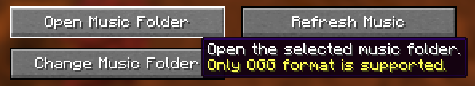
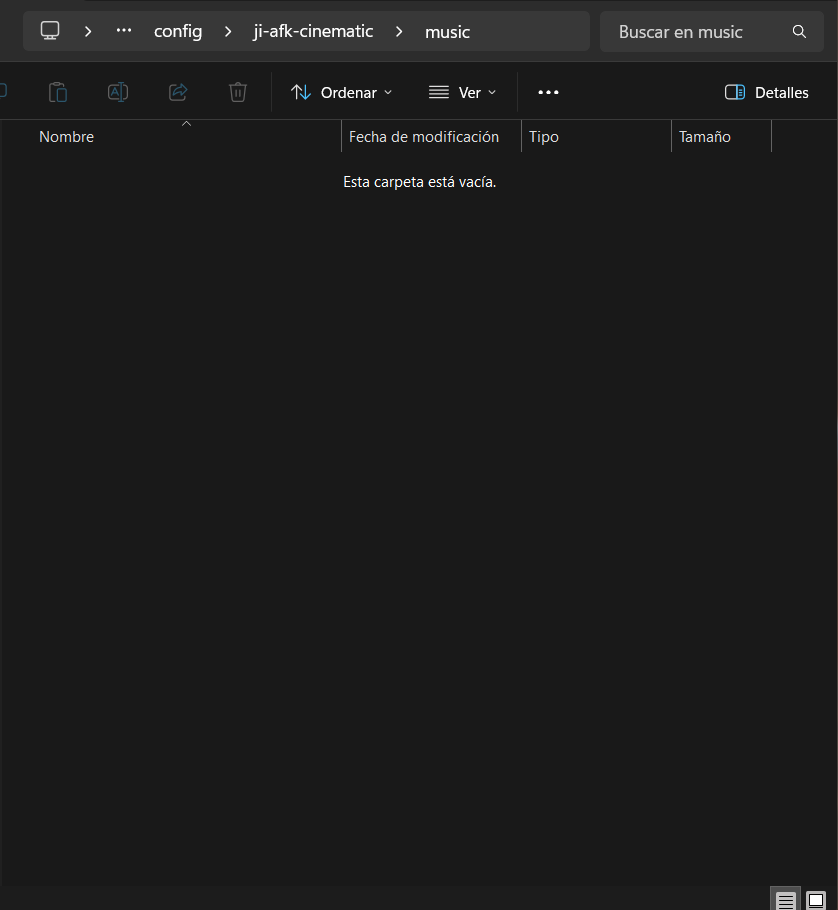
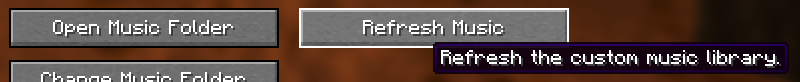
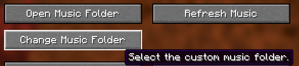
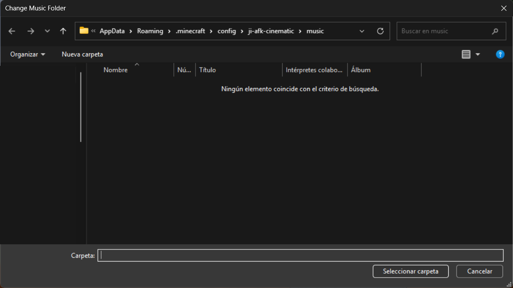

# Using Your Own Local Music

You can play your own downloaded music during Ji-AFK Cinematic without creating a resource pack. Add the files to the mod's music folder, refresh the library, and choose a music mode that includes custom tracks.

> [!IMPORTANT]
> Only Ogg Vorbis files with the `.ogg` extension are supported. Files inside subfolders are not scanned, so place every track directly in the selected music folder.

## Open the mod settings

1. While playing, press **F7 + H** to open the Ji-AFK Cinematic settings.

   Alternatively, if you have [Mod Menu](https://modrinth.com/mod/modmenu) installed, open **Mods**, select **Ji-AFK Cinematic**, and click its configuration button.

2. Find the **Music Mode** button. It is set to **Vanilla** by default.
3. Click the button to cycle from **Vanilla** to **Mixed** or **Custom**, depending on which music you want to hear.

## Choose a music mode

The available music modes are:

| Vanilla | Mixed | Custom |
|:---:|:---:|:---:|
|  |  |  |
| Minecraft music only | Minecraft music and custom tracks | Custom tracks only (local files and compatible packs) |

Choose **Mixed** if you want both Minecraft music and your own tracks. Choose **Custom** if you want cinematics to use only custom tracks. The folder controls appear only in these two modes.

If **Custom** is selected but no valid custom tracks are available, the cinematic music pool will be empty.

## Add music to the default folder

1. Make sure **Cinematic Music** is **ON**, then select **Mixed** or **Custom** in the mod settings.
2. Click **Open Music Folder**.

   

3. File Explorer opens the folder currently used by the mod. By default, it is:

   ```text
   .minecraft/config/ji-afk-cinematic/music
   ```

   

4. Copy or drag your `.ogg` files directly into this folder. Do not place them inside subfolders.
5. Return to Minecraft and click **Refresh Music**. Wait for the resource reload to finish and for the button to report that the music was refreshed.

   

6. Click **Save & Close**. Your tracks can now be selected during cinematics.

Whenever you add, remove, rename, or replace a track while Minecraft is running, click **Refresh Music** again.

## Use a different folder

You can keep your music somewhere else instead of using the default folder:

1. Select **Mixed** or **Custom**.
2. Click **Change Music Folder**.

   

3. Browse to the folder you want to use, then confirm it with your system's folder-selection button. The dialog language and appearance depend on your operating system.

   

4. Click **Save & Close** so the new folder is applied.
5. Copy your `.ogg` files directly into that folder.
6. Reopen the mod settings and click **Refresh Music**.

**Open Music Folder** will now open the selected location.

## If a track does not appear

- Confirm that the file is encoded as Ogg Vorbis and ends in `.ogg`. Renaming an `.mp3` or another file type does not convert it.
- Keep the file directly in the selected folder; nested folders are ignored.
- Make sure **Cinematic Music** is **ON** and the mode is **Mixed** or **Custom**.
- Click **Refresh Music** after every change made while the game is running.

## Return to Minecraft music only

Open the settings, change **Music Mode** to **Vanilla**, and click **Save & Close**. You do not need to delete your custom files; they remain available if you switch back to **Mixed** or **Custom** later.

## Resource-pack authors

This guide is for loose `.ogg` files stored in a local folder. To distribute music as a Minecraft resource pack, or to declare custom sound events, see [Compatible Resource-Pack Music](RESOURCE-PACK-MUSIC.md).
